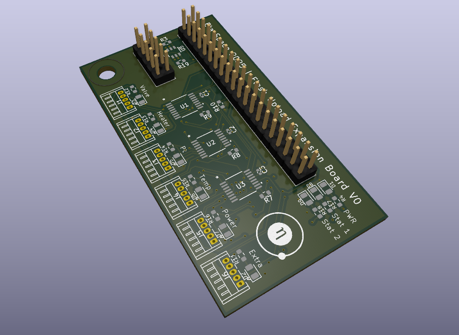

# Plex Loader
A PCB designed to route traffic for flashing many devices with one central programmer.

BOM (per unit) 💣
| Parts | QT | Description | Link |
|---|---|---|---|
| TMUX1208 | 3 | Bidirectional Multiplexer | [link](https://digikey.com/en/products/detail/texas-instruments/TMUX1208PWR/9746210) |
dsPIC33f | 1 | An extra PIC for testing | [link](https://www.digikey.com/en/products/detail/microchip-technology/DSPIC33FJ128GP204-E-PT/1635665) |
| MOSFET PNP | 1 | Used as pain power switch | [link](https://www.digikey.com/en/products/detail/vishay-siliconix/sq3457ev-t1-ge3/7566744) |
| 0.1uf Cap | 5 | Decoupling cap used for Mux and Pic | [link](https://www.digikey.com/en/products/detail/murata-electronics/GRM155R71C104KA88J/2610892) |
| 10uf Cap | 1 | Decoupling cap on Pic | [link](https://www.digikey.com/en/products/detail/yageo/CC0603KRX5R6BB106/5195191) |
| 10k res | 5 | General pull up | [link](https://www.digikey.com/en/products/detail/yageo/RC0603JR-0710KL/726700) |
| 1k res | 9 | Pull up and led | [link](https://www.digikey.com/en/products/detail/yageo/RC0603JR-0710KL/726700https://www.digikey.com/en/products/detail/yageo/RC0402JR-071KL/726408) |
| 100 res | 3 | Used in on MCLR on pic | [link](https://www.digikey.com/en/products/detail/yageo/RC0603FR-07100RL/726888) |
| 50 res | 2 | Used in on PGC and PGD on pic | [link](https://www.digikey.com/en/products/detail/yageo/RT0603BRE0750RL/5928059) |
| DF13-5P-1.25DS | 6 | Female conn used for program out | [link](https://www.digikey.com/en/products/detail/hirose-electric-co-ltd/DF13-5P-1-25DS-25/15997289) |
| DF13-5S-1.25C | 6 | Male conn for harness | [link](https://www.digikey.com/en/products/detail/hirose-electric-co-ltd/DF13-5S-1-25C/241752) |
| H4BXG-10112-R6 | 6 | Red wire 12"| [link](https://www.digikey.com/en/products/detail/hirose-electric-co-ltd/H4BXG-10112-R6/426070) |
| H4BBG-10112-G6 | 6 | Green wire 12" | [link](https://www.digikey.com/en/products/detail/hirose-electric-co-ltd/H4BBG-10112-G6/425566) |
| H4BBG-10112-L6 | 6 | Blue wire 12" | [link](https://www.digikey.com/en/products/detail/hirose-electric-co-ltd/H4BBG-10112-L6/425574) |
| H4BBG-10112-W6 | 6 | White wire 12"| [link](https://www.digikey.com/en/products/detail/hirose-electric-co-ltd/H4BBG-10112-W6/425614) |
| H4BBG-10112-B6 | 6 | Black wire 12"| [link](https://www.digikey.com/en/products/detail/hirose-electric-co-ltd/H4BBG-10112-B6/425558) |
| LED | 6 | Green LED for prog status | [link](https://www.digikey.com/en/products/detail/ams-osram-usa-inc/LG-R971-KN-1-0-20-R18/1227925) |
| LED | 1 | RED LED for POWER | [link](https://www.digikey.com/en/products/detail/w%C3%BCrth-elektronik/150080AS75000/11479384https://www.digikey.com/en/products/detail/w%C3%BCrth-elektronik/150080RS75000/4489918) |
| LED | 2 | Yellow LED for status | [link](https://www.digikey.com/en/products/detail/w%C3%BCrth-elektronik/150080YS75000/4489927) |
| 40-Pin Header | 1 | 20x2 pin GPIO connector designed to fit on top of the pi carrier | [link](https://www.amazon.com/2-54mm-Pitch-Female-Double-Header/dp/B083RYV9J1/ref=sr_1_5?crid=23T94ULNM1VGI&dib=eyJ2IjoiMSJ9.IZekvpBp0XXaz2v75rS4v5AAaBUo75aGOuvNzmgG0wnsSkzaQmTVWPlxJ6VvfE0f56EzXmtxPTVq_Bp05KU1vZw4qibp6W7BiLWmouShe2begYuwmQ36428Fkl8EqqnX4ZzDv6lCg2FDvj7mJGDzhcS9a4t1R-dsujDnuwS_XeSOxbsKj_jdD2DRuF0Do_GieX-ZABRTo5XiOjrZYZSxqJuPLxnLQbdPUKYzYtLkY-A.2vNHihG3SQbyL_2sp_jhnvoGpGV7xwEzqs0ZmllS3qk&dib_tag=se&keywords=2.54mm+header+long+lead+female&qid=1737236504&sprefix=2.54mm+header+long+lead+female%2Caps%2C128&sr=8-5) |
| 10-Pin Header| 1 | 2x5 used for cm4 configs | [link](https://www.amazon.com/ZYAMY-2-54mm-Straight-Stackable-Connector/dp/B0778M5P1W/ref=sr_1_3?crid=23T94ULNM1VGI&dib=eyJ2IjoiMSJ9.IZekvpBp0XXaz2v75rS4v5AAaBUo75aGOuvNzmgG0wnsSkzaQmTVWPlxJ6VvfE0f56EzXmtxPTVq_Bp05KU1vZw4qibp6W7BiLWmouShe2begYuwmQ36428Fkl8EqqnX4ZzDv6lCg2FDvj7mJGDzhcS9a4t1R-dsujDnuwS_XeSOxbsKj_jdD2DRuF0Do_GieX-ZABRTo5XiOjrZYZSxqJuPLxnLQbdPUKYzYtLkY-A.2vNHihG3SQbyL_2sp_jhnvoGpGV7xwEzqs0ZmllS3qk&dib_tag=se&keywords=2.54mm+header+long+lead+female&qid=1737236504&sprefix=2.54mm+header+long+lead+female%2Caps%2C128&sr=8-3) |

Label Guide

| Components                     | Value/Part Number           |
|--------------------------------|-----------------------------|
| C1, C2, C3, C4, C5             | 0.1 µF                     |
| C6                             | 10 µF                      |
| D1, D2, D3, D4, D5, D6, D7, D8, D9 | LED                        |
| J1, J2, J3, J4, J5, J6         | DF13-5P-1.25DS             |
| J9                             | 40-Pin Header |
| J10                            | 10-Pin Header        |
| R1, R3, R5, R6, R10            | 10 kΩ                      |
| R4, R11, R12, R13, R14, R15, R16, R17, R18 | 1 kΩ                |
| R2, R9 R19                        | 100 Ω                      |
| R7, R8                     | 50 Ω                       |
| U1, U2, U3                     | TMUX1208PWR                |
| U4                             | dsPIC33f          |
| U5                             | MOSFET PNP            |
💣